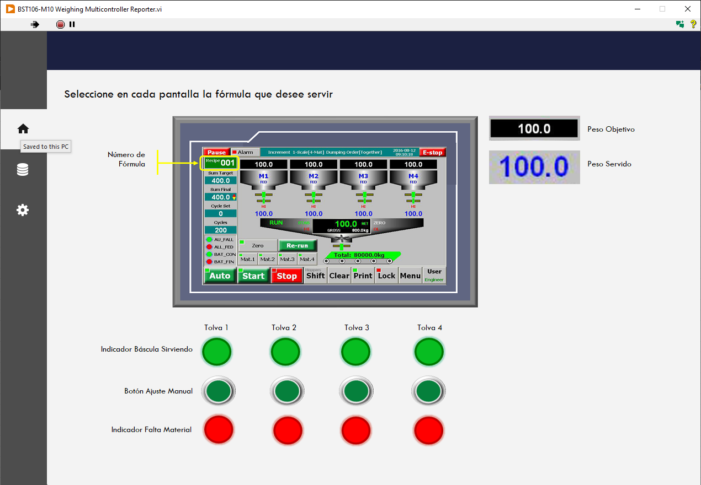

# BST106-M10 Weighing Multicontroller Reporter

---

  

## Overview

**BST106-M10 Weighing Multicontroller Reporter** is a LabVIEW application developed to manage and monitor multiple **BST106-M10 weighing controllers** connected through serial communication.

The application allows operators to configure, control, and monitor multiple hoppers simultaneously, eliminating the need to configure each controller manually.

Recipes are loaded from an Excel-generated file and automatically deployed to all connected controllers. The system also collects operational data and generates a final report that allows efficiency analysis and performance comparison between hoppers.

The application was developed using **LabVIEW 2025**.

---

## Key Features

### Multi-Controller Management

- Supports **multiple BST106-M10 controllers connected simultaneously**
- Handles multiple serial sessions automatically
- Maintains an internal array of active controller connections

### Automated Recipe Deployment

- Recipes are defined in **Excel**
- Excel generates a **TXT file** that the application reads
- The program extracts:
  - Table headers
  - Recipe parameters
- Recipes are automatically written to each controller

### Controller Monitoring

- Assigns a recipe to each hopper
- Sends execution commands to each controller
- Monitors controller status during operation

### Automated Reporting

After execution the application generates a **final report** containing:

- Recipe information
- Execution time per hopper
- Process timing
- Hopper performance comparison

This enables analysis of:

- Operational efficiency
- Process consistency
- Performance differences between hoppers

---

## System Operation

### 1. Recipe Import

The application reads a **TXT file generated from Excel**.

During this process the program:

- Opens the TXT file
- Reads table headers and values
- Populates the application's internal table

---

### 2. Controller Configuration

The system loads previously saved configuration files:

- `ComNumber`
- `ComConfig`

These files define:

- Number of controllers
- COM port assignment for each controller

The application then:

- Populates the controller configuration
- Adjusts the COM port array according to the selected number of controllers

---

### 3. COM Port Validation

Before establishing communication the application verifies that:

- No COM ports are empty
- Each controller has a valid COM port assigned

If any configuration is missing the system prevents connection until corrected.

---

### 4. Serial Session Initialization

When configuration is valid:

- A serial session is opened for each controller
- All sessions are stored in an **array of serial connections**
- A **"Main Load" indicator** is displayed while sessions initialize

---

### 5. Process Execution

During operation the application:

- Sends the selected recipe to each hopper
- Commands each controller to start the process
- Monitors controller communication and status

---

### 6. Data Collection and Reporting

After the process finishes:

- The report timestamp is recorded
- Data is stored in a **matrix indexed by controller**
- A consolidated performance report is generated

This information allows evaluation of:

- Hopper efficiency
- Execution times
- System performance comparisons

---

## System Architecture

The application consists of the following main components:

| Component | Description |
|--------|--------|
| Recipe Loader | Reads TXT files exported from Excel |
| Controller Configuration | Loads and saves COM port settings |
| Serial Manager | Manages serial communication sessions |
| Recipe Dispatcher | Sends recipe parameters to controllers |
| Monitoring Engine | Tracks controller status |
| Report Generator | Creates final performance reports |

---

## Requirements

- **LabVIEW 2025**
- Serial communication capability
- **BST106-M10 weighing controllers**
- Excel-generated TXT recipe file

---

## Supported Hardware

- **BST106-M10 Weighing Controller**
- Multiple hoppers connected via serial communication

---

## Typical Workflow

1. Export recipe from Excel  
2. Load TXT recipe file into the application  
3. Configure number of controllers and COM ports  
4. Establish serial communication  
5. Deploy recipes to controllers  
6. Run process  
7. Generate final performance report  

---

## Purpose

This tool was developed to improve **operational efficiency and process consistency** by:

- Eliminating manual controller configuration
- Automating recipe deployment
- Monitoring multiple hoppers simultaneously
- Generating comparative performance reports